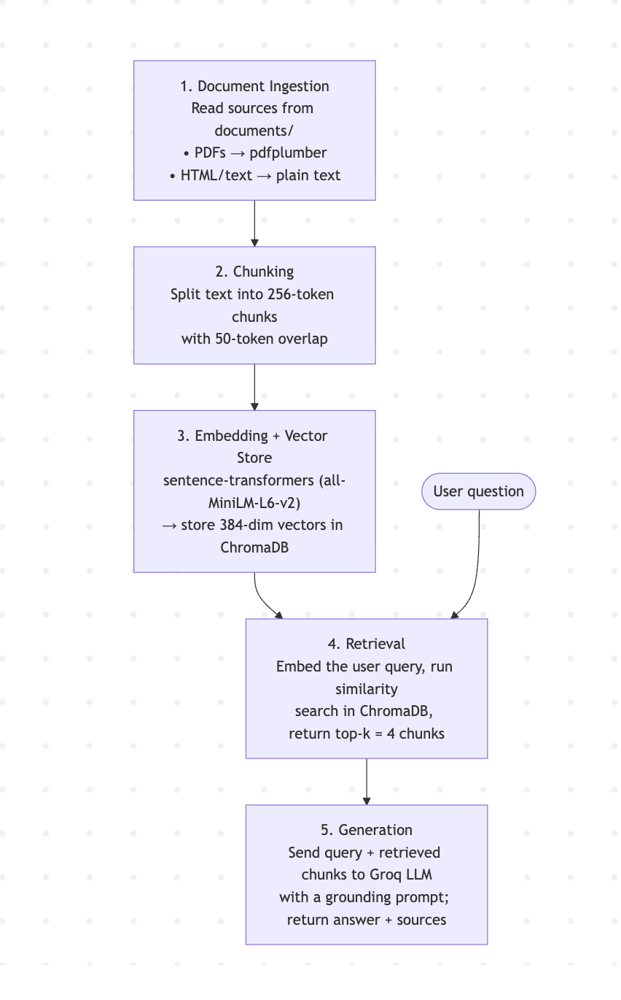

# Project 1 Planning: The Unofficial Guide

> Write this document before you write any pipeline code.
> Your spec and architecture diagram are what you'll use to direct AI tools (Claude, Copilot, etc.) to generate your implementation — the more specific they are, the more useful the generated code will be.
> Update the Retrieval Approach and Chunking Strategy sections if you change your approach during implementation.
> Update this file before starting any stretch features.

---

## Domain

<!-- What domain did you choose? Why is this knowledge valuable and hard to find through official channels? -->
I chose software development best practices because I enjoy designing well-structured software systems before implementation. This knowledge is valuable because it helps students evaluate design alternatives, identify potential issues early, and build maintainable, testable applications rather than focusing solely on getting code to work.

While resources on software development exist, practical guidance on software design, testing strategies, architecture decisions, and code maintainability is often scattered across engineering blogs, documentation, discussion forums, and industry experiences. Many computer science students and early-career developers spend significant time preparing for data structures and algorithms interviews but have fewer opportunities to learn the design and engineering practices used to build production-quality software. This RAG system aims to make that knowledge more accessible and searchable.

---

## Documents

<!-- List your specific sources: URLs, subreddit names, forum threads, or file descriptions.
     Aim for at least 10 sources that together cover different subtopics or perspectives within your domain. -->

| # | Source | Description | URL or location |
|---|--------|-------------|-----------------|
| 1 |Digital Ocean |SOLID Principles|https://www.digitalocean.com/community/conceptual-articles/s-o-l-i-d-the-first-five-principles-of-object-oriented-design|
| 2 |SourceMaking|Architectural Patterns |https://sourcemaking.com/design_patterns|
| 3 |Google|Code Quality |https://google.github.io/eng-practices/review/|
| 4 |Kent Beck |Test Driven Development |https://www2.cs.uh.edu/~rsingh/documents/software_design/TDD.pdf|
| 5 |Martin Fowler |Technical Debt|https://martinfowler.com/bliki/TechnicalDebtQuadrant.html|
| 6 |Refactoring Guru |Code Smells |https://refactoring.guru/refactoring/smells|
| 7 |Missing Semester |Version Control|https://missing.csail.mit.edu/2020/version-control/|
| 8 |Missing Semester |Debugging and Profiling |https://missing.csail.mit.edu/2020/debugging-profiling/|
| 9 |Software Engineering Stack Exchange|Is unit testing / TDD worthwhile? (community discussion)|https://softwareengineering.stackexchange.com/questions/140156/is-unit-testing-or-test-driven-development-worthwhile|
| 10 |Conventional Commits|Conventional Commits|https://www.conventionalcommits.org/en/v1.0.0/|

---

## Chunking Strategy

<!-- How will you split documents into chunks?
     State your chunk size (in tokens or characters), overlap size, and explain why those
     numbers fit the structure of your documents.
     A review-heavy corpus warrants different chunking than a long FAQ. -->

**Chunk size:**
256 tokens

**Overlap:**
50 tokens

**Reasoning:**

 The corpus consists primarily of software engineering articles, documentation, and educational resources that explain concepts through examples and best practices. I chose a chunk size of 256 tokens because it matches the maximum sequence length of the embedding model (`all-MiniLM-L6-v2`). Since the model truncates anything beyond 256 tokens, using larger chunks would result in part of the content being ignored during embedding. Keeping chunks at 256 tokens ensures that all of the text contributes to the vector representation while still being focused enough to capture a specific concept, such as technical debt, refactoring, code reviews, or design patterns.

I chose a 50-token overlap to help preserve context between neighboring chunks. Many of the documents discuss ideas across multiple paragraphs, and important explanations can sometimes straddle a chunk boundary. Without overlap, part of a concept could end up in one chunk and the rest in another, making it harder to retrieve the full idea. The overlap helps keep related information connected while avoiding excessive duplication in the vector database.

Overall, this strategy aims to balance precise retrieval with enough surrounding context to understand the concept being discussed. The goal is to return focused but meaningful passages when users ask questions about software development best practices.

---

## Retrieval Approach

<!-- Which embedding model are you using (e.g., all-MiniLM-L6-v2 via sentence-transformers)?
     How many chunks will you retrieve per query (top-k)?
     If you were deploying this for real users and cost wasn't a constraint, what tradeoffs
     would you weigh in choosing a different embedding model — context length, multilingual
     support, accuracy on domain-specific text, latency? -->

**Embedding model:**
`all-MiniLM-L6-v2`, loaded through the `sentence-transformers` library. I chose this model because it runs locally (no API key or cost), is fast, and produces 384-dimensional embeddings that work well for general-purpose semantic search. Its 256-token maximum sequence length is also what my 256-token chunk size is built around, so the model and the chunking strategy are aligned — every chunk is embedded in full with no truncation.

**Top-k:**
Top-k = 4. For each query I retrieve the 4 most similar chunks. With 256-token chunks, 4 results give the language model enough context to answer most questions while keeping the prompt small and focused, which reduces the chance of pulling in off-topic passages.

**Production tradeoff reflection:**
If I were deploying this system for real users and cost were not a concern, I would consider using a larger embedding model. While all-MiniLM-L6-v2 is fast, free, and works well for this project, it has a maximum input length of 256 tokens, which limits chunk size. A larger model with a longer context window, such as BAAI/bge-base-en-v1.5 or a hosted model like OpenAI's text-embedding-3-large, would allow larger chunks that can capture more complete concepts without truncation.

I would evaluate several tradeoffs before making that decision. Larger models generally provide better retrieval accuracy and can capture more nuanced technical concepts, which could be beneficial for a software engineering knowledge base. However, they also introduce additional costs and, in the case of hosted APIs, potential privacy concerns since data must be sent to an external service. They may also increase latency compared to a local model.

For this project, I believe all-MiniLM-L6-v2 is the right choice because it is free, efficient, and performs well enough for the size and scope of my corpus. If I continued developing the system for production use, I would likely explore larger embedding models and determine whether the improvement in retrieval quality justified the added cost and complexity.

---

## Evaluation Plan

<!-- List your 5 test questions with their expected correct answers.
     Questions should be specific enough that you can judge whether the system's response
     is right or wrong. "What are good dining halls?" is too vague.
     "What do students say about wait times at [dining hall name] during lunch?" is testable. -->

| # | Question | Expected answer |
|---|----------|-----------------|
| 1 | What does the "S" in SOLID stand for, and what does it mean? | The Single Responsibility Principle: a class should have only one responsibility, i.e. only one reason to change. (Source: DigitalOcean SOLID article) |
| 2 | What are the four quadrants of Martin Fowler's Technical Debt Quadrant? | The two axes are Reckless vs. Prudent and Deliberate vs. Inadvertent, giving four quadrants: Reckless-Deliberate, Reckless-Inadvertent, Prudent-Deliberate, and Prudent-Inadvertent. (Source: Fowler, Technical Debt Quadrant) |
| 3 | What are the three steps of the Test-Driven Development cycle? | Red, Green, Refactor: write a small failing test, write just enough code to make it pass, then refactor the code while keeping the test passing. (Source: Kent Beck, TDD) |
| 4 | What is the structure of a Conventional Commit message? | `<type>[optional scope]: <description>`, with an optional body and footer. Common types include `feat` (a new feature) and `fix` (a bug fix); a `BREAKING CHANGE:` footer or `!` marks a breaking change. (Source: Conventional Commits v1.0.0) |
| 5 | According to Google's code review guidelines, what is the standard a reviewer should use when deciding to approve a change? | A reviewer should approve a change once it definitely improves the overall code health of the system, even if it is not perfect — progress over perfection. (Source: Google Engineering Practices, Code Review) |

---

## Anticipated Challenges

<!-- What could go wrong? Name at least two specific risks with reasoning.
     Consider: noisy or inconsistent documents, missing source attribution, off-topic
     retrieval, chunks that split key information across boundaries. -->

1. **One oversized source dominating retrieval.** The Refactoring book (source #6) is far longer than my other sources. If I ingest the whole book, it will produce many more chunks than everything else combined, so the index becomes mostly "book." A query about an unrelated topic (e.g. commit conventions) could then return book passages that are only loosely similar simply because there are so many of them, crowding out the smaller, more on-point source. To mitigate this I plan to ingest only the relevant chapter(s) of the book rather than the full text, keeping the corpus balanced across all ten sources.

2. **Key information split across chunk boundaries.** Because chunks are a fixed 256 tokens, an explanation that spans a boundary can be partly in one chunk and partly in the next, so retrieval might return only half of the needed context and the model could answer incompletely. My 50-token overlap reduces this risk by repeating the boundary text in both chunks, but it does not eliminate it for concepts that stretch across several chunks.

3. **Noisy text from PDF extraction.** Two of my sources are PDFs read with `pdfplumber`, which can introduce artifacts such as page numbers, headers/footers, and broken line breaks. This noise can pollute chunks and weaken embedding quality. I plan to do light preprocessing (stripping repeated headers/footers and collapsing stray line breaks) before chunking to reduce this.

---

## Architecture

<!-- Draw a diagram of your pipeline showing the five stages:
     Document Ingestion → Chunking → Embedding + Vector Store → Retrieval → Generation
     Label each stage with the tool or library you're using.
     You can use ASCII art, a Mermaid diagram, or embed a sketch as an image.
     You'll use this diagram as context when prompting AI tools to implement each stage. -->

**Stage-by-stage summary:**

| Stage | What happens | Tool / library |
|-------|--------------|----------------|
| 1. Document Ingestion | Load each source file and extract raw text | `pdfplumber` (PDFs), built-in file reading (text/HTML) |
| 2. Chunking | Split text into 256-token chunks, 50-token overlap | custom `chunk_text()` function |
| 3. Embedding + Vector Store | Turn each chunk into a vector and store it | `sentence-transformers` (`all-MiniLM-L6-v2`) + `chromadb` |
| 4. Retrieval | Embed the query, find the 4 most similar chunks | `chromadb` similarity search (top-k = 4) |
| 5. Generation | Answer the question using only the retrieved chunks | `groq` LLM API |

---

## AI Tool Plan

<!-- For each part of the pipeline below, describe:
     - Which AI tool you plan to use (Claude, Copilot, ChatGPT, etc.)
     - What you'll give it as input (which sections of this planning.md, which requirements)
     - What you expect it to produce
     - How you'll verify the output matches your spec

     "I'll use AI to help me code" is not a plan.
     "I'll give Claude my Chunking Strategy section and ask it to implement chunk_text()
     with my specified chunk size and overlap" is a plan. -->

I will use Claude in the IDE as a coding assistant throughout the development process while implementing, testing, and evaluating my RAG system.

**Milestone 3 — Ingestion and chunking:**

Using my Documents table and Chunking Strategy, I will implement a load_documents() function that reads files from documents/ (using pdfplumber for PDFs) and a chunk_text() function that creates 256-token chunks with 50-token overlap.

I will verify the implementation by ensuring documents load correctly, PDFs extract without errors, chunk sizes are approximately 256 tokens, and adjacent chunks contain overlapping content.

**Milestone 4 — Embedding and retrieval:**

Using the all-MiniLM-L6-v2 embedding model and a top-k value of 4, I will build a persistent ChromaDB collection that stores embeddings and source metadata, along with a retrieve(query) function that returns the most relevant chunks.

I will verify the system by running evaluation questions and confirming that retrieved chunks come from the expected sources.

**Milestone 5 — Generation and interface:**

I will implement grounded answer generation and a simple Gradio interface. The system will combine a user's question with retrieved chunks, send the prompt to a Groq-hosted language model, and return an answer with source citations.

The model will be instructed to answer only from the provided context and respond with "I don't know based on the provided sources" when information is unavailable. I will verify grounding using both in-domain and out-of-domain questions.
